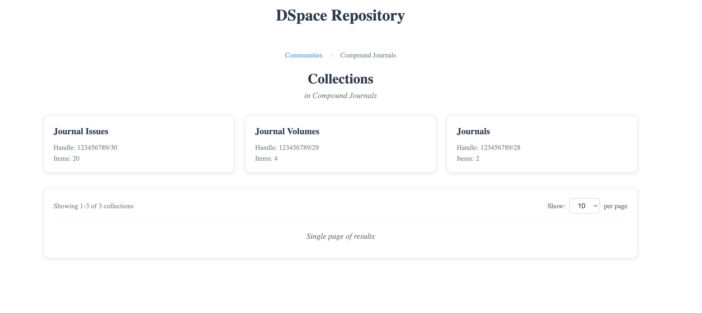
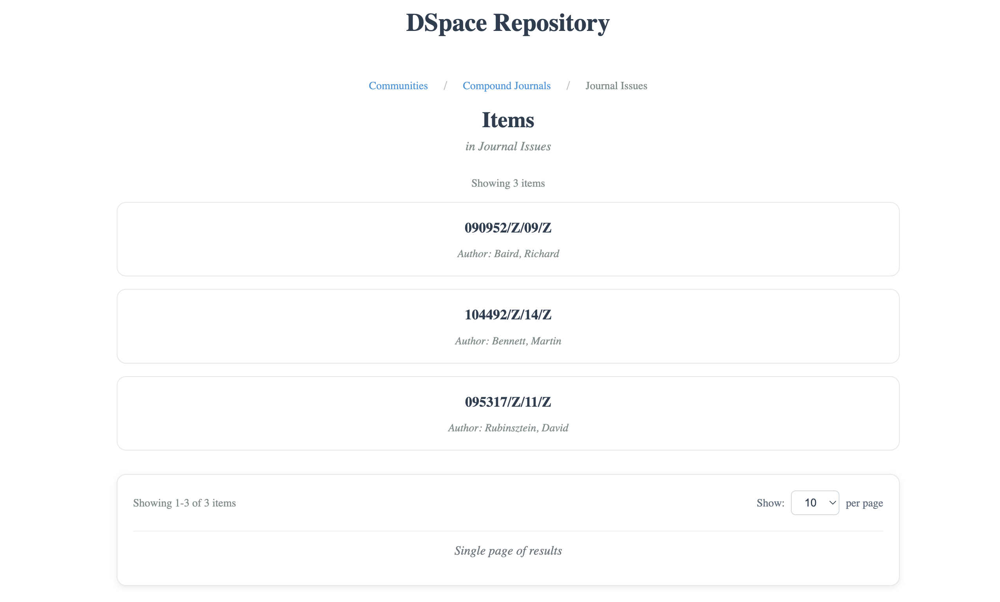
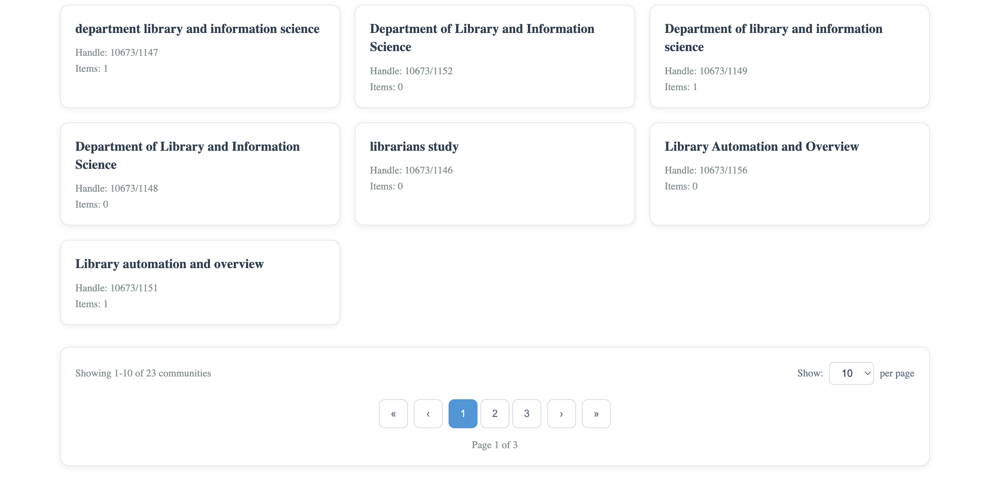

# DSpace Repository Frontend

A modern Angular application for browsing and exploring DSpace digital repositories.

## 📱 Application Screenshots

### 1. Communities Overview


_Main page showing all available communities with pagination controls_

### 2. Collections View


_Collections within a selected community, displaying collection cards_

### 3. Items Display


_Items within a selected collection, showing item names and authors_

### 4. Additional Communities View


_Alternative view of communities showing different pagination or layout_

## 🏗️ Project Structure

```
angular-dspace-frontend/
├── src/
│   ├── app/
│   │   ├── components/
│   │   │   ├── community-list/          # Communities listing component
│   │   │   ├── collection-list/         # Collections within a community
│   │   │   ├── item-list/              # Items within a collection
│   │   │   └── pagination/             # Reusable pagination component
│   │   ├── services/
│   │   │   ├── dspace.service.ts       # DSpace API communication
│   │   │   └── state.service.ts        # Centralized state management
│   │   ├── app.component.ts            # Main application component
│   │   ├── app.component.html          # Main application template
│   │   └── app.routes.ts               # Application routing
│   ├── assets/                         # Static assets (images, icons)
│   ├── styles.css                      # Global styles
│   ├── main.ts                         # Application entry point
│   └── index.html                      # Main HTML template
├── package.json                         # Project dependencies and scripts
├── angular.json                         # Angular CLI configuration
└── tsconfig.json                       # TypeScript configuration
```

## 🛠️ Setup & Run

### Prerequisites

- Node.js 18.0.0+
- npm 9.0.0+
- Angular CLI 18.1.0+

### Installation

```bash
# Clone and navigate to project
cd angular-dspace-frontend

# Install dependencies
npm install

# Start development server
npm start
# or
ng serve
# or
ng serve --port 4000
```

The application will be available at `http://localhost:4000/`

## 🔧 Available Scripts

- `npm start` - Start development server
- `npm run build` - Build for production
- `ng serve` - Start development server (Angular CLI)
- `ng build` - Build the application
